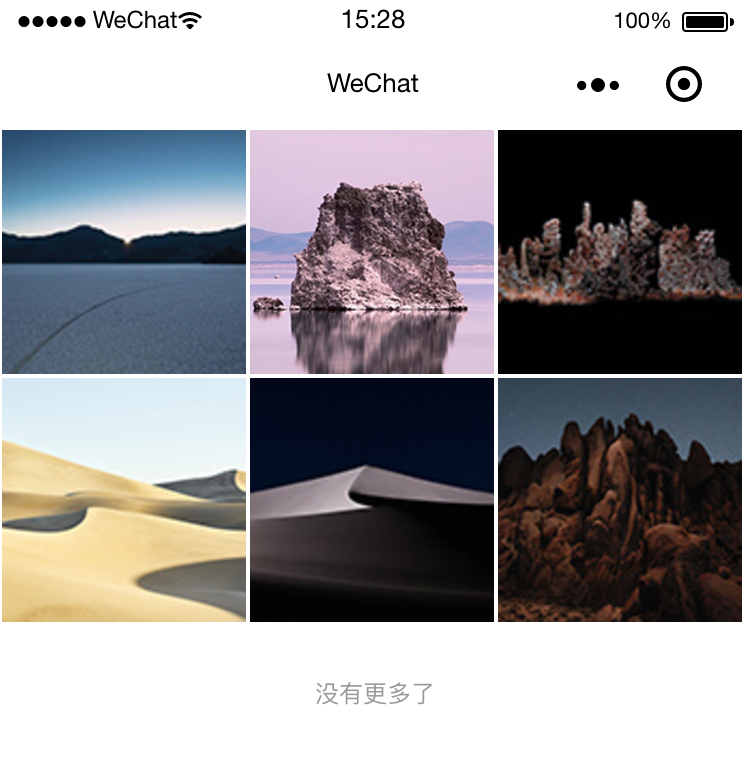
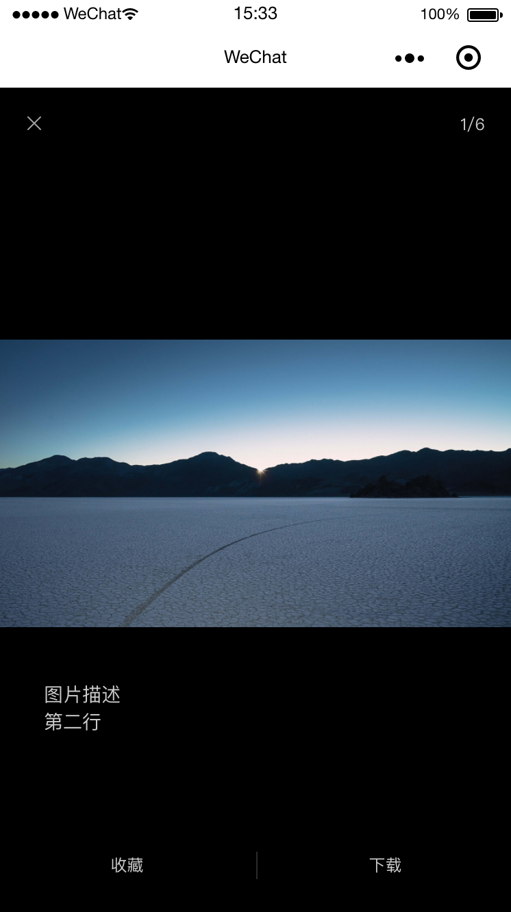
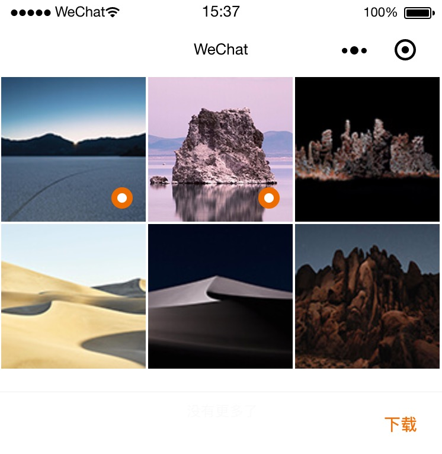

# mp-photo-album

v1.2.0

小程序照片墙/自定义大图预览/多图下载

## 使用

### 安装

```
npm install --save --production mp-photo-album
```

### 引入

```json
{
  "usingComponents": {
    "mp-photo-album": "/miniprogram_npm/mp-photo-album/index"
  }
}
```

### 功能

#### 1. 照片列表/滚动加载



#### 2. 大图预览/手势缩放/下载/自定义操作




##### wxml

```html
<mp-photo-album list="{{list}}" bindlike="like" bindclose="finish" likeTitle="收藏"></mp-photo-album>
```

##### 图片列表数据结构

```javascript
[{
  src: 'https://raw.githubusercontent.com/panmenglin/mp-photo-album/transform/common/images/Desert1.jpg', // 原图
  previewSrc: 'https://raw.githubusercontent.com/panmenglin/mp-photo-album/transform/common/images/Desert1_1280.jpg', // 预览大图
  listSrc: 'https://raw.githubusercontent.com/panmenglin/mp-photo-album/transform/common/images/Desert1_200.jpg', // 列表小图
  desc: '图片描述', // 图片描述
  check: false // 是否选中
}]
```

#### 配置

likeTitle 

自定义按钮文字

bindlike

自定义按钮事件

bindclose

关闭预览回调


#### 3. 多选保存到相册

选择多图，点击下载保存到相册，最多同时9张



##### wxml

```html
<mp-photo-album list="{{list}}" option="{{option}}" bindfinish="finish"></mp-photo-album>

<view wx:if="{{option !== 'download'}}" bindtap="select">选择</view>
<view wx:if="{{option === 'download'}}" bindtap="finish">完成</view>
```

配置

option [默认] normal

用来切换操作方式

切换为 download 时，则可以选择并进行下载

bindfinish

点击下载的回调
